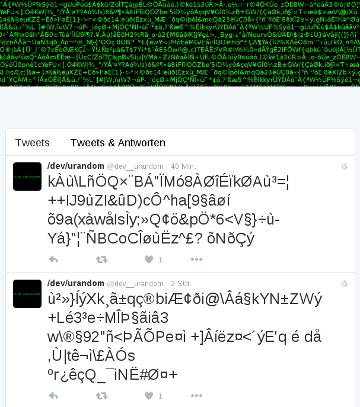

# /dev/urandom Twitter Bot

Tweeting the wisdom of [/dev/urandom](http://linux.die.net/man/4/urandom) at [@dev__urandom](https://twitter.com/dev__urandom).  
Never out of things to say, due to the source of its inspiration.

## Run it
* Clone/Fork the repo
* Register an app at [https://dev.twitter.com/apps](https://dev.twitter.com/apps)
* Copy your tokens to `credentials.py`
* Ignore changes to `credentials.py`, so you don't commit your keys:
  `git update-index --assume-unchanged credentials.py`
* Run `python tweet.py`
